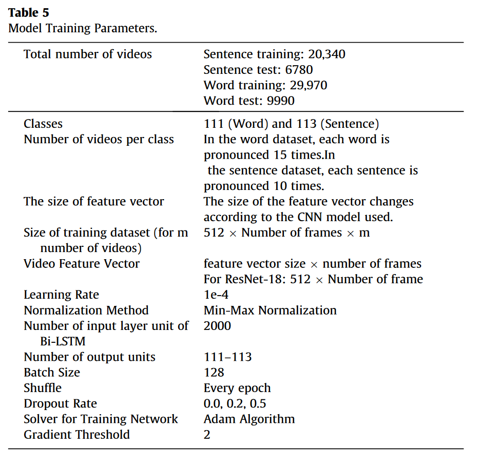

# Turkish lip-reading using Bi-LSTM and deep learning models

## Dataset

The paper develops two novel datasets using the Turkish language, one only made up of words and one only of sentences. The word dataset consists of 111-word and the sentence dataset consists of 113-sentence.
The words and sentences are in different lengths and selected among those which are used in daily life. All the video frames used to create the dataset were obtained under the same ambient and light conditions, and each speaker is located at 1.5 m in these images. During the shooting of the images, the 12 MP wide-angle camera of the iPhone 11 mobile phone is used.
The frames retrieved from videos are rotated 10 degrees clockwise and counterclockwise to correct the differences in the lip structure of the people and possible angular changes that may be caused by the camera.
It uses the MediaPipe framework for face recognition and extraction.

## Model and training

### Model structure and parameters

### Bi-LSTM

Considering the number of classes and the large amount of data in our study, we used 2000 hidden units.
The author uses 0.4 as value for the forget gate.

### CNN

    In the proposed approach, pre-trained models are preferred for the CNN model used to extract features from video frames. In this study, ResNet-18, Resnet50, Xception, ShuffleNet, Nasnetmobile, AlexNet, Vgg16, Darknet53, Darknet59 architectures are selected as pre-trained CNN models

### Output and loss

The author uses a softmax activation and encodes a full sentence as a single entry in the vocabulary!

    There are 113 sentences and 111 words in the dataset created to be used in the study. For this reason, 111 separate classes for words and 113 separate classes for sentences have been defined. In addition, since the length of each video may be different, the number of frames is also different.

### Results

The author uses the SRR (Sentence Recognition Rate) as performance indicator for its sentence-level classification task.
